# Phase0–Phase4 工作进度展示包

## 计划目的
研究目标：在昂贵且容易失败的物理仿真（如 VMEC）与强约束设计空间（如 GSCO-Lite）下，构建一个可复现的多目标优化框架，并探索两类“提升可行性与收敛效率”的关键算子：

- **HeuRepairOp（领域修复算子）**：在产生候选解后进行结构化修复，减少无效输入与仿真失败。
- **LLM-SemOp（语义算子）**：用 LLM 生成“语义层面”的编辑提案，期望在低预算阶段更快提升 Pareto 质量。

## 我们要做什么（项目概述）

一句话：我们要在“仿真昂贵 + 候选解很容易不合法/失败”的多目标优化问题上，搭建一个可复现的优化框架（FusionOpt），并验证 **领域修复算子（HeuRepair）** 与 **LLM 语义算子（LLM-SemOp）** 是否能更稳定地产生可行解、提高收敛效率与最终 Pareto 质量。

要解决的核心困难：

- 仿真评估成本高（预算有限，容错率低）。
- 搜索空间强约束，随机扰动很容易生成无效输入或导致仿真不收敛。
- 多目标优化需要维护一组解（Pareto 前沿），而不是单点最优。

研究对象（两个代表性任务）：

- VMEC（`stellarator_vmec`）：输入为一组 Fourier 系数的改动，仿真可能不收敛。
- GSCO-Lite（`stellarator_coil_gsco_lite`）：输入为离散 coil cells，约束强、非法结构多。

我们的方法：

- Phase0/1：建立统一协议与 baseline 套件，让对比可复现、可量化。
- Phase2：实现 FusionOpt v1 主循环：多算子产生子代 + gate/repair + 昂贵评估 + 选择 + 统一日志。
- Phase3：加入 HeuRepairOp（领域修复），重点提升可行率/减少失败。
- Phase4：加入 LLM-SemOp（语义算子），将 LLM 作为“产生子代的算子”参与搜索，并配套严格校验与回退。

## 核心机制：算子怎么设计的（阅读指南）

FusionOpt v1 的核心思想：把“产生新方案”抽象为可组合的 **operators**，不同 operator 只是“产生子代 decision_json 的方法不同”，但后续都走同一条稳定管线：

1) operator 产生 `decision_json`（子代）
2) `gate`：便宜的结构/格式检查（不通过直接丢弃）
3) `HeuRepair`（可选）：把“快要违规/太激进”的输入修得更保守
4) `dedup`：去重（generation/run 范围）
5) `evaluate`：昂贵仿真评估，落盘并记录 `status/cv/feasible`

下面按组件解释（对应代码：`fusionopt/engine.py`、`fusionopt/adapters_*.py`、`fusionopt/heu_repair.py`、`fusionopt/llm_semop.py`）。

### A) 标准算子（std operators）：`std_crossover / std_mutation / std_resample`

目标：提供稳定、快速、无外部依赖的“常规搜索步”。

- `std_resample`：从零随机生成一个候选（探索）。
- `std_mutation`：对单个父代做小改动（局部搜索）。
- `std_crossover`：融合两个父代的结构（组合/重组）。

这些算子的实现放在 adapter 里（因为 VMEC/GSCO-Lite 的 decision 结构不同）：

- VMEC：`fusionopt/adapters_vmec.py`
- GSCO-Lite：`fusionopt/adapters_gsco.py`

### B) Operator sampling：算子如何“被选中”参与生成子代

每次要生成一个子代时，引擎会按权重抽样选择一种算子（`fusionopt.operator_weights`）：

- `std_crossover`
- `std_mutation`
- `std_resample`
- `llm_semop`

这意味着 LLM 不是“替代 GA/替代优化器”，而是和交叉/变异并列的一个“产生子代的方式”。

### C) Gate：什么叫“安全验证”，为什么 gate 不通过就直接丢弃

`gate` 的定位：**只做最便宜、最确定的结构检查**（例如 JSON 必须能解析、关键字段必须存在、类型必须合理）。

- VMEC gate：要求存在非空 `new_coefficients`，并把值强制转为 float 后 canonicalize。
- GSCO gate：要求存在 `cells: list`，并 canonicalize。

设计原则：

- gate 失败通常意味着“结构根本不对”，继续修复没有可靠定义，因此直接丢弃。

### D) HeuRepairOp：启发式领域修复（发生在仿真之前）

HeuRepair 的定位：对已经通过 gate 的候选进行“结构化修正”，把输入变得更安全、更可能仿真成功。

- 触发时机：`gate` 通过后、`evaluate` 之前（在引擎 `_gate_and_repair` 中）。
- 可配置：可全开/全关，或用 `fusionopt.heu_repair.prob` 按概率触发。

两个任务的修复逻辑不同（代码在 `fusionopt/heu_repair.py`）：

- VMEC 修复：限制整体相对改动、抑制高阶模态、避免过激系数导致不收敛。
- GSCO 修复：修 cell 数量上下限、去孤立尖刺、平滑极性/间距等，减少非法结构。

### E) Dedup：为什么要去重

在强约束+强修复下，不同路径可能产生相同 JSON。去重可以减少浪费评估预算。

- `fusionopt.gate.dedup_scope = generation`：每代内去重。
- `fusionopt.gate.dedup_scope = run`：整个 run 内去重（默认）。

### F) LLM-SemOp：LLM 如何“参加生成新样本”

LLM-SemOp 的定位：也是一种 operator。它的特点是：

- 不是直接输出最终最优解，而是输出一个 **可被评估的候选 decision_json**。
- 必须经过同样的 `gate + HeuRepair + dedup` 管线，失败就丢弃。

具体机制（`fusionopt/llm_semop.py` + `fusionopt/engine.py`）：

- 引擎每代开头（当 `w_llm > 0`）会 `maybe_schedule_batch(generation, population)`：
  - 从当前 population 抽取父代 decision_json 作为上下文
  - 构造 prompts（指定严格 JSON schema）
  - 后台线程批量请求 LLM
  - 将通过 LLM 内部 schema 校验 + adapter.gate 的候选放入队列
- 当引擎抽样抽到 `llm_semop` 时：
  - `try_get_candidate()` 从队列取一个候选当子代
  - 如果队列为空：立刻回退到标准算子（不会阻塞主循环）

输出格式（LLM 必须返回 JSON 对象）：

- VMEC：`{"new_coefficients": {"RBC(1,1)": -0.236}}`
- GSCO-Lite：`{"cells": [[phi, theta, state], ...]}`（`state` 为 -1 或 1）

工程保障（用于可复现与排错）：

- LLM 调用日志：`run_dir/logs/llm_calls.jsonl`
- LLM 缓存：`run_dir/cache/llm/`（相同 prompt+模型参数可复用）

## 当前进展

- **Phase0 已完成**：统一评测协议与日志落盘（任意 run 可用 `check_phase0_protocol.py` 校验）。
- **Phase1 已完成**：基线套件与实验编排（多算法/多 seed 一键运行）。
- **Phase2 已完成（v1）**：FusionOpt v1 主循环骨架 + 统一档案/协议日志（Phase3/4 的实验在此基础上继续叠加新算子）。
- **Phase3 已完成**：HeuRepairOp 在 VMEC/GSCO-Lite 上的消融与多 seed 汇总（核心主图见下）。
- **Phase4 已完成（初版）**：LLM-SemOp 的原型集成与小预算（budget=200）对比；同时给出 Relay 负对照，强调必须做严格校验与回退。

本文件用于快速展示阶段性成果图表与口头汇报要点。

---

## 1) Phase0：评测协议/可复现性

- Phase0 打通了 `results/{problem_id}/{algo_id}/{run_id}/` 的统一落盘，包含 `evaluations.csv`、`generations/`、`final/pareto_front.csv`、`run_meta.json`、`config.yaml`。
- 通过 `check_phase0_protocol.py` 可对任意 run 做协议合规检查。

---

## 2) Phase1：基线套件与实验编排（Status: DONE）

目标：让“跑基线、对比、画图”的成本足够低，后续迭代才能快。

关键产出：

- `run_all_baselines.py`：一键运行多基线（支持多 seed）。
- `baseline_*.py`、`run_gsco_baselines.py`：VMEC 与 GSCO-Lite 的经典/启发式基线入口。

### Phase1 里说的 baseline 是什么？

这里的 **baseline** 指“没有使用我们新增算子（HeuRepair、LLM-SemOp）的传统/经典方法”，用于回答：

- 如果不加修复、不加 LLM，单靠传统搜索/进化策略，能达到什么水平？
- 我们新增算子是否真的带来了提升（可行率、HV、top1 等）？

baseline 不是只有一种算法，而是一组“代表性对照组”。它们的共同点：

- 都遵循同一评测协议与落盘格式，保证公平可比。
- 都直接调用同一个 evaluator（VMEC 或 GSCO-Lite），区别只在“如何产生新样本/如何选择下一代”。

#### VMEC baselines（多目标进化算法为主）

- `baseline_ga.py`：经典 GA 风格（交叉/变异 + 代际循环）。
- `baseline_nsga2.py`：NSGA-II（多目标精英选择）。
- `baseline_sms.py`：SMS-EMOA（基于超体积贡献的选择，更强调 HV）。
- `baseline_moead.py`：MOEA/D（分解式多目标优化，pymoo 实现）。
- `baseline_rvea.py`：参考方向/参考向量引导的多目标进化算法（pymoo 实现）。
- `baseline_krvea.py`：参考向量类方法的一个变体（本项目中还包含 surrogate / reference-agent 等探索性组件；属于额外探索，不是 FusionOpt 主线）。

#### GSCO-Lite baselines（启发式搜索 + pymoo 多目标算法）

- `run_gsco_baselines.py --algo random`：随机搜索（纯探索）。
- `run_gsco_baselines.py --algo ga`：经典 GA（离散结构上的交叉/变异）。
- `run_gsco_baselines.py --algo sa`：模拟退火（单点邻域搜索 + 退火接受准则）。
- `run_gsco_baselines.py --algo greedy`：贪心/局部搜索（快速、但容易陷入局部最优）。
- `baseline_gsco_pymoo.py {nsga2|sms|moead|rvea}`：pymoo 提供的多目标算法，在 cell-based JSON 表示上实现交叉/变异。

可视化（展示用）：基线覆盖矩阵（每行一个问题，每列一个基线）。

---

## 3) Phase2：FusionOpt v1（多算子骨架 + 统一档案）（Status: DONE for v1）

目标：抽象“优化器级别主循环”，统一算子接口、门控/修复、昂贵评估与协议日志，形成可复现、可对比的框架骨架。

关键产出：

- `run_fusionopt.py`：FusionOpt v1 入口脚本。
- `fusionopt/`：v1 引擎、适配器、协议对齐、（预留）LLM-SemOp 管理等模块。
- `problem/*/config_fusionopt_v1_smoke.yaml`：两个问题的 smoke 配置入口。

可视化（展示用）：FusionOpt v1 主循环示意图（Phase3/4 都是在这个骨架上加新算子）。

- `showcase/figures/phase2_fusionopt_v1_overview.png`

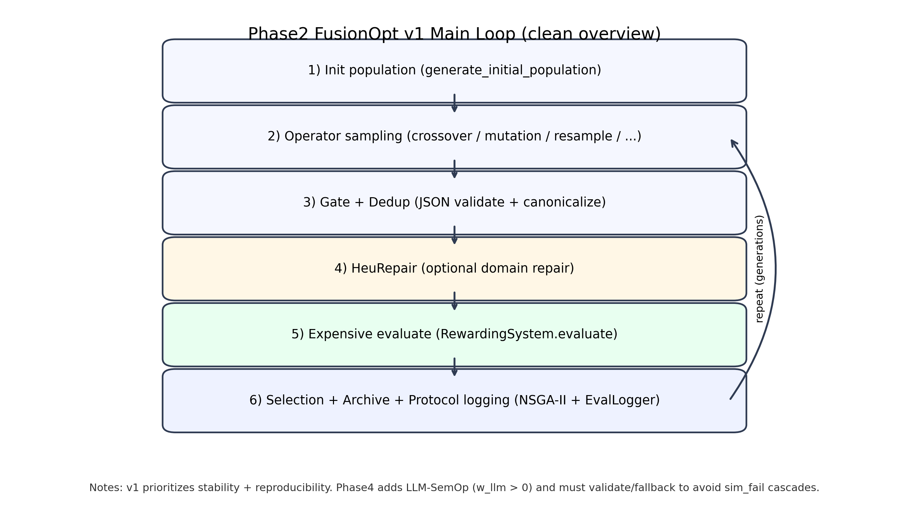

---

## 4) Phase3：HeuRepairOp（领域修复算子）消融结果

### Phase3 的 baseline（对照组）是什么？

Phase3 这里的 **baseline** 不是 Phase1 的“传统算法套件”，而是 **FusionOpt v1 主循环本身**（标准算子 + NSGA-II 选择 + 协议日志）作为骨架，再做“修复算子开/关”的消融：

- `HeuOn`：开启 HeuRepair（即在 `gate` 通过后、仿真前做启发式修复）。
- `HeuOff`（baseline/对照组）：关闭 HeuRepair（或将修复概率设为 0），其余配置与 HeuOn 保持一致。

因此 Phase3 的对比可以理解为：**只改“是否修复”，其它都不变**，用来判断修复算子对可行率/HV 的影响。

### 4.1 VMEC：stress v11（多 seed 汇总，核心主图）

**结论（一句话）**：在 stress v11 设置下，HeuRepair **整体提升可行评估率**（多 seed 均值更高），HV 与 HeuOff **接近**（该 stress 版本主要用于放大可行性差异）。

- `HeuOn`（mean）最终可行率：约 **0.958**
- `HeuOff`（mean）最终可行率：约 **0.933**

文件：
- `showcase/figures/phase3_stress_vmec_v11_multiseed_summary.png`

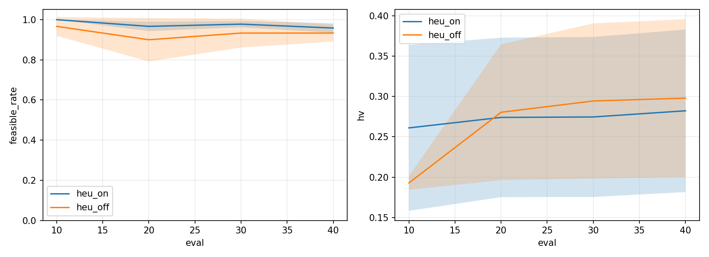

### 4.2 VMEC：stress v11（seed 42/43/44，辅助图）

用途：展示曲线形态（Feasible rate / HV / CV 分布）在单次 run 层面的差异。

- `showcase/figures/phase3_stress_vmec_v11_heu_on_vs_off_seed42.png`

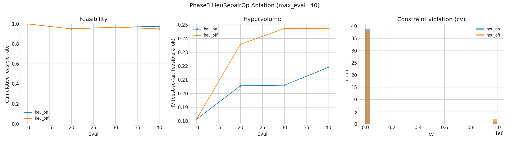

- `showcase/figures/phase3_stress_vmec_v11_heu_on_vs_off_seed43.png`

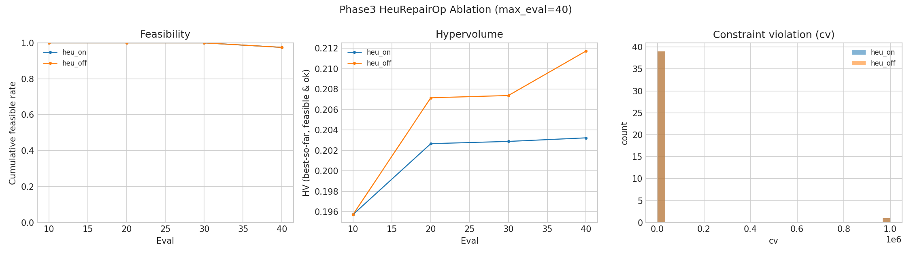

- `showcase/figures/phase3_stress_vmec_v11_heu_on_vs_off_seed44.png`

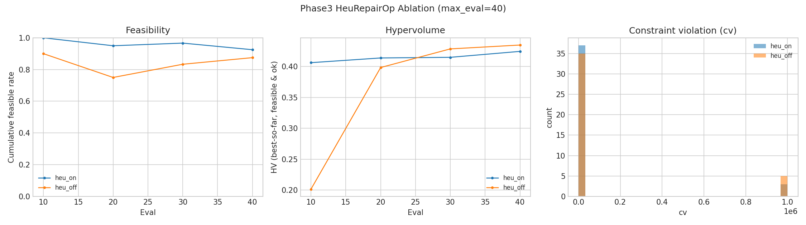

### 4.3 GSCO-Lite：stress v3（多 seed 汇总，核心主图）

**结论（一句话）**：在 GSCO-Lite stress v3 下，HeuRepair 将可行率从 ~0.73 提升到 **1.0**，并且 HV 也有小幅提升（多 seed 平均）。

- `HeuOn`（mean）最终可行率：**1.0**
- `HeuOff`（mean）最终可行率：约 **0.733**
- `HeuOn`（mean）最终 HV：约 **0.539**
- `HeuOff`（mean）最终 HV：约 **0.529**

文件：
- `showcase/figures/phase3_stress_gsco_v3_multiseed_summary.png`

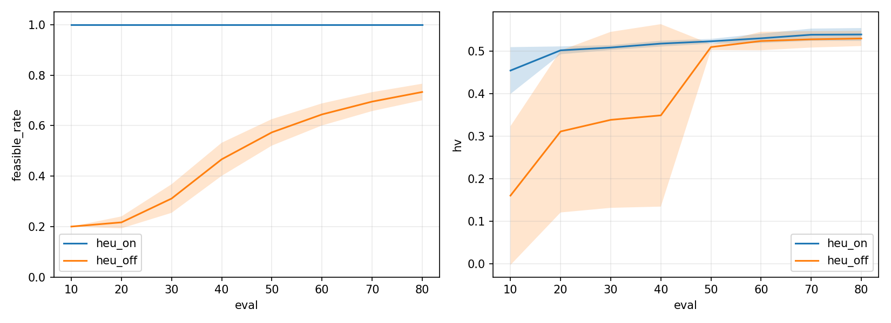

### 4.4 GSCO-Lite：stress v3（seed 42/43/44，辅助图）

- `showcase/figures/phase3_stress_gsco_v3_heu_on_vs_off_seed42.png`

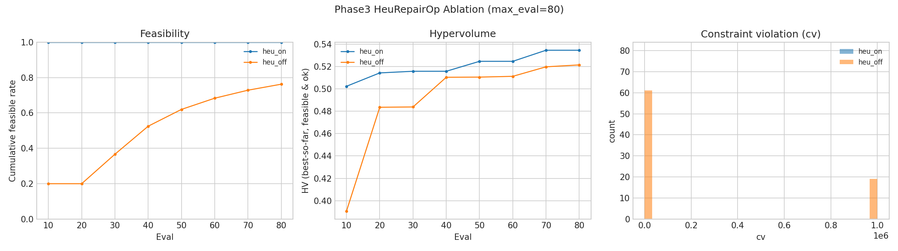

- `showcase/figures/phase3_stress_gsco_v3_heu_on_vs_off_seed43.png`

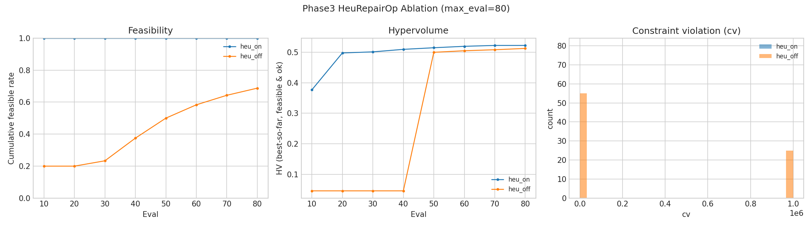

- `showcase/figures/phase3_stress_gsco_v3_heu_on_vs_off_seed44.png`

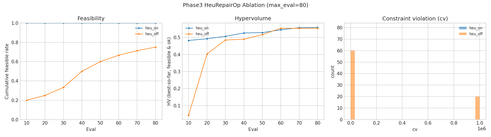

### 4.5 Phase3 base（seed42，非 stress 的参考图）

用途：说明在“非 stress / 更温和”配置下，HeuRepair 不一定有明显差异（符合预期：修复算子主要解决不可行/崩溃）。

- `showcase/figures/phase3_base_vmec_heu_on_vs_off_seed42.png`

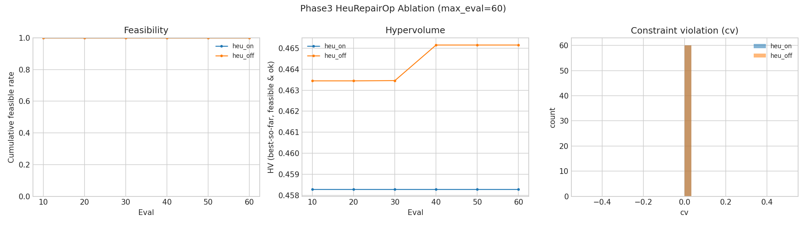

- `showcase/figures/phase3_base_gsco_heu_on_vs_off_seed42.png`

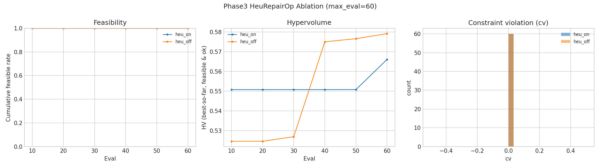

### 4.6 Phase3：reference-agent（参考向量/参考方向自适应，对比图）

用途：展示“参考方向自适应策略”在同一协议下的对比结果（属于 Phase3 额外探索，不是 FusionOpt 主线）。

说明：在某些 smoke/低预算设置下，两种策略可能得到**几乎一致**的曲线，因此视觉上会像“只有一条线”。

文件（若已复制到 `showcase/figures/`，可直接打开或在本 md 中改回嵌入显示）：

- `showcase/figures/phase3_ref_compare_fixed_vs_adaptive.png`
- `showcase/figures/phase3_ref_compare_fixed_vs_llm_budget2000.png`

---

## 5) Phase4：LLM-SemOp（语义算子）初步结果（VMEC budget=200）

### Phase4 的 baseline（对照组）是什么？

Phase4 这里的 **baseline/对照组** 同样是 **FusionOpt v1 骨架**，区别只在是否启用 LLM-SemOp：

- `LLM-SemOp`：将 LLM 作为一个 operator（`llm_semop`）按权重参与生成子代（队列为空会回退到标准算子）。
- `Baseline`（对照组）：禁用 LLM-SemOp（例如 `fusionopt.operator_weights.llm_semop = 0` 或 `fusionopt.llm_semop.enabled = false`），子代仅来自 `std_crossover/std_mutation/std_resample`。

因此 Phase4 的对比可以理解为：**只改“是否让 LLM 参与产生子代”，其它设置尽量一致**，用来检验语义算子的收益。

### 5.1 Baseline vs LLM-SemOp（核心展示图）

**结论（一句话）**：在 budget=200 下，两条曲线整体非常接近（有时会高度重合），在该 seed 上 SemOp 的 HV 有**小幅提升**；后续需要更高预算与多 seed 进一步验证。

文件：
- `showcase/figures/phase4_llm_semop_budget200_seed42.png`

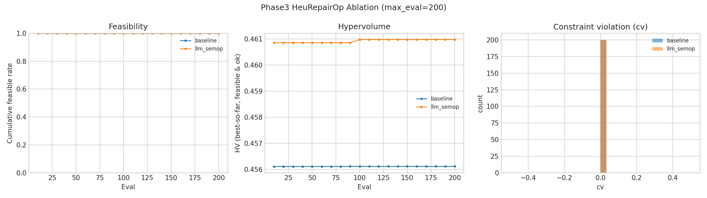

如果你已经复制了 `results/` 下的对比图（更像“最终汇报图”），也可以用（注意：若两条线完全重合，视觉上会像“只有一个模型”）：
- `showcase/figures/phase4_compare_baseline_vs_llm_semop_budget200_seed42.png`

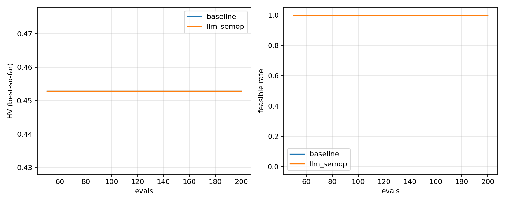

### 5.2 负对照：Relay（全 sim_fail）

用途：强调 Phase4 的工程重点——**LLM 输出必须严格校验并可回退**，否则会出现全失败的灾难性情况。

文件：
- `showcase/figures/phase4_llm_semop_relay_budget200_seed42.png`

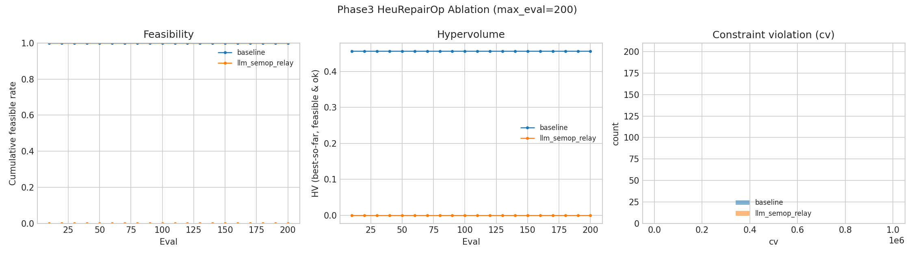

### 5.3 更难的 VMEC benchmark 变体：Phase4HardV2（budget=200, seed=42）

背景：在 Phase4 初版配置下，VMEC 的可行率接近 1.0，且第三目标容易出现饱和/退化，导致 LLM-SemOp 的优势不明显。为对齐 GSCO-Lite 上“强约束/强修复收益”的实验形态，我们在 **不改框架逻辑** 的前提下，仅通过配置构造更难的 VMEC 变体：

- 降低 `heu_repair.prob`（从 1.0 -> 0.25），让不可行与 `sim_fail` 开始出现
- 允许 low-order 改动 + 增大变异幅度，提高搜索难度（更接近“需要修复/语义编辑”的场景）

结果（seed=42, budget=200）：

- Baseline：`feasible_rate=0.995`，`HV=0.4014`，`top1=0.5861`（`sim_fail=1/200`）
- LLM-SemOp：`feasible_rate=0.995`，`HV=0.4223`，`top1=0.6053`（`sim_fail=1/200`）

图（HV/top1 曲线，Phase4HardV2）：

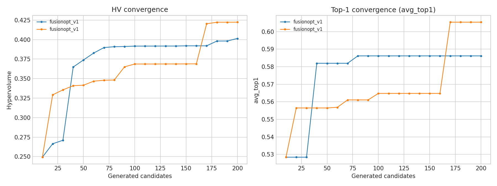

#### 5.3.1 Multi-seed（seed=42/43/44）汇总（budget=200）

逐 seed 指标（最终值）：

| seed | setting | feasible_rate | HV | top1 |
| --- | --- | --- | --- | --- |
| 42 | Baseline | 0.995 | 0.4014 | 0.5861 |
| 42 | LLM-SemOp | 0.995 | 0.4223 | 0.6053 |
| 43 | Baseline | 1.000 | 0.4396 | 0.6006 |
| 43 | LLM-SemOp | 1.000 | 0.4065 | 0.5804 |
| 44 | Baseline | 1.000 | 0.4624 | 0.6526 |
| 44 | LLM-SemOp | 1.000 | 0.4356 | 0.6304 |

结论（当前 hard 强度下）：

- 可行率在 3 个 seed 上都接近 1（0.995–1.0），**仍偏“温和”**，对“修复/语义编辑带来可行性收益”的检验不够强。
- HV/top1 在 seed=42 上提升，但在 seed=43/44 上下降，说明在 budget=200 的设置下，SemOp 的收益 **跨 seed 不稳定**；需要更多 seed / 更高预算，或进一步加大 hard（v3）以更接近 coil benchmark 的“强约束”形态。

曲线（seed=43/44）：

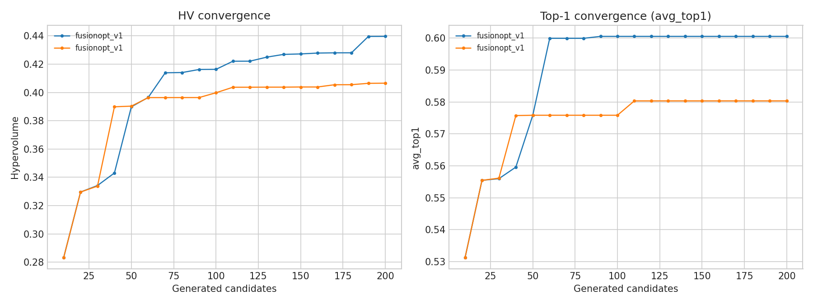

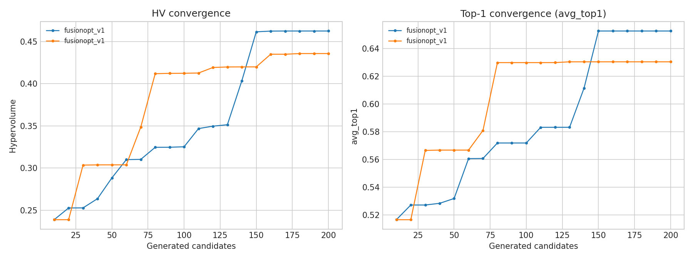

#### 5.3.2 Phase4HardV3（budget=200, seed=42）快速验证

动机：进一步降低可行率（更接近 coil benchmark 的“强约束/易失败”形态），让修复/语义编辑的收益更容易显性化。

结果（seed=42, budget=200）：

- Baseline：`feasible_rate=0.995`，`HV=0.4881`，`top1=0.6247`（`sim_fail=1/200`）
- LLM-SemOp：`feasible_rate=0.995`，`HV=0.4491`，`top1=0.6221`（`sim_fail=1/200`）

小结：v3 相比 v2 **可行率没有明显下降**（仍接近 1），且该 seed 下 HV/top1 未体现稳定优势。下一步需要继续加大 hard（例如进一步降低/关闭 `heu_repair.prob`、降低 `max_attempts_per_child`、增大低阶系数扰动幅度）并做 multi-seed 才能更有力地展示 LLM-SemOp 的收益。

配置入口：

- `problem/stellarator_vmec/config_phase4_hard_v2_baseline_budget200.yaml`
- `problem/stellarator_vmec/config_phase4_hard_v2_llm_semop_budget200_openai.yaml`

v3 配置入口：

- `problem/stellarator_vmec/config_phase4_hard_v3_baseline_budget200.yaml`
- `problem/stellarator_vmec/config_phase4_hard_v3_llm_semop_budget200_openai.yaml`

说明：你提到的“coil benchmark 上修复算子可行性更高且 HV 更高”的现象，在 GSCO-Lite stress 设置下非常明显；VMEC 需要通过类似的 stress/hard 设计（让不可行与失败更常见）才能更好地检验修复/语义算子带来的收益。Phase4HardV2 已经开始出现失败样本，但难度仍偏温和（可行率仍接近 1），后续建议多 seed 并进一步加大 hard 强度。

#### 5.3.3 Phase4HardV4（budget=200, seed=42）快速验证

动机：继续加大 hard，使 `sim_fail`/不可行更常见，从而更容易检验“语义编辑/修复”在强约束下带来的收益。

结果（seed=42, budget=200）：

- Baseline：`feasible_rate=1.000`，`HV=0.6215`，`top1=0.6817`
- LLM-SemOp：`feasible_rate=1.000`，`HV=0.6293`，`top1=0.7210`

#### 5.3.4 Phase4HardV5（budget=200, seed=42）快速验证

结果（seed=42）：

- Baseline：`feasible_rate=0.995`，`HV=0.9022`，`top1=0.8298`
- LLM-SemOp：该次 run 提前结束（`n_rows=170`，非满 budget），因此仅作参考：`feasible_rate=0.976`，`HV=0.9338`，`top1=0.8392`

#### 5.3.5 Phase4HardV6（budget=200）Multi-seed（seed=42–47）汇总

逐 seed 指标（最终值，HV 使用 `f*_min` 三目标，ref=`[1.1,1.1,1.1]`；`top1` 为可行样本中最大 `total`）：

| seed | setting | feasible_rate | HV | top1 |
| --- | --- | --- | --- | --- |
| 42 | Baseline | 0.610 | 0.6183 | 0.6994 |
| 42 | LLM-SemOp | 0.605 | 0.6728 | 0.7384 |
| 43 | Baseline | 0.630 | 1.1653 | 0.9504 |
| 43 | LLM-SemOp | 0.620 | 0.6565 | 0.7220 |
| 44 | Baseline | 0.585 | 0.7312 | 0.7382 |
| 44 | LLM-SemOp | 0.595 | 0.6744 | 0.7000 |
| 45 | Baseline | 0.555 | 0.6832 | 0.7030 |
| 45 | LLM-SemOp | 0.595 | 0.7047 | 0.7264 |
| 46 | Baseline | 0.585 | 0.7081 | 0.7459 |
| 46 | LLM-SemOp | 0.665 | 0.6614 | 0.7021 |
| 47 | Baseline | 0.585 | 0.6680 | 0.7135 |
| 47 | LLM-SemOp | 0.670 | 0.6778 | 0.7244 |

多 seed 汇总（mean ± std）：

- Baseline：`feasible_rate=0.592±0.026`，`HV=0.762±0.201`，`top1=0.758±0.096`
- LLM-SemOp：`feasible_rate=0.625±0.034`，`HV=0.675±0.017`，`top1=0.719±0.015`

剔除 seed=43（baseline 离群）后：

- Baseline：`feasible_rate=0.584±0.019`，`HV=0.682±0.043`，`top1=0.720±0.021`
- LLM-SemOp：`feasible_rate=0.626±0.038`，`HV=0.678±0.016`，`top1=0.718±0.017`

结论（Phase4HardV6 强度下）：

- 可行率已从 v2/v3/v4 的接近 1.0 降到 ~0.55–0.67，hardening 有效。
- LLM-SemOp 在本组设置下 **平均提升可行率**（剔除离群 seed43 后，paired delta 均值约 `+0.042`），但对 `HV/top1` 的提升 **不稳定**（剔除离群 seed43 后，HV paired delta 均值约 `-0.0035`，接近 0）。

关于 seed=43 baseline 为什么异常强（解释要点）：

- 该 seed 很早（`eval_id=36`, `generation=3`）找到一个“接近饱和”的可行点：`volume_raw≈44.15`（接近上界 45）、`aspect_ratio_raw≈8.87`（接近下界 8）、且 `magnetic_shear_raw≈1.12` 超过上界 1.05。
- 由于 objective normalization 的 clipping（超上界会被截断为最优），该点对应 `magnetic_shear_min=0`，从而把 `total` 与 HV 明显抬高，形成离群。

#### 5.3.6 Phase4HardV6（budget=1000, seed=46）Rerun（Baseline vs LLM-SemOp）

说明：该 seed 的首次 `budget=1000` 运行因手动关闭 IDE 导致后台进程中断，因此采用 `nohup` 方式重跑（rerun），以下指标以 rerun 为准；并且我们将不再继续其他 seed 的 `budget=1000` 计算。

结果（seed=46, budget=1000，HV 使用 `f*_min` 三目标，ref=`[1.1,1.1,1.1]`）：

- Baseline：`feasible_rate=0.559`，`HV=1.1961`，`top1(total)=0.9089`
- LLM-SemOp：`feasible_rate=0.597`，`HV=1.2293`，`top1(total)=0.9424`

对应 run_dir：

- Baseline：
  - `results/stellarator_vmec/fusionopt_v1/Stellarator_VMEC_Phase4HardV6_Baseline_Budget1000_seed46_20260103T074647_rerun`
- LLM-SemOp：
  - `results/stellarator_vmec/fusionopt_v1/Stellarator_VMEC_Phase4HardV6_LLM_SemOp_Budget1000_OpenAI_seed46_20260103T074650_rerun`

#### 5.3.7 GSCO-Lite Phase4（budget=200, seed=43）Baseline vs LLM-SemOp

说明：该 benchmark 在当前 Phase4 配置下可行率仍然饱和（`feasible_rate=1.0`），因此主要看 `HV/top1(total)` 的提升。

结果（seed=43, budget=200，HV 使用 `f*_min` 三目标，ref=`[1.1,1.1,1.1]`）：

- Baseline：`feasible_rate=1.0`，`HV=0.5752`，`top1(total)=2.2936`
- LLM-SemOp：`feasible_rate=1.0`，`HV=0.6152`，`top1(total)=2.3326`

对应 run_dir：

- Baseline：
  - `results/stellarator_coil_gsco_lite/fusionopt_v1/GSCO_Phase4_Baseline_B200_seed43_20260103T214645`
- LLM-SemOp：
  - `results/stellarator_coil_gsco_lite/fusionopt_v1/GSCO_Phase4_LLM_SemOp_B200_seed43_20260103T214645`

#### 5.3.8 VMEC 经典 baselines（GA / NSGA2, budget=1000, seed=42）结果（与 FusionOpt 指标口径对齐）

说明：GA/NSGA2 采用 MOLLM 的 baseline runner，默认的 `objective_ranges` 与 Phase4HardV6 并不一致（例如 `magnetic_shear` 范围过窄会导致 clipping/饱和）。为与 FusionOpt 的 Phase4HardV6 指标口径对齐，我们基于保存的 raw properties 重新用 Phase4HardV6 的范围进行归一化，并计算 `feasible_rate/HV/top1(total)`（HV ref=`[1.1,1.1,1.1]`）。

- GA：`feasible_rate=0.9985`，`HV=0.2635`，`top1(total)=0.5397`
- NSGA2：`feasible_rate=0.9990`，`HV=0.2635`，`top1(total)=0.5397`

对应结果文件（baseline runner 输出）：

- GA：
  - `moo_results_vmec_baselines/zgca,gemini-2.5-flash-nothinking/mols/volume_aspect_ratio_magnetic_shear_vmec_baseline_ga_b1000_baseline_GA_optimized_42.pkl`
- NSGA2：
  - `moo_results_vmec_baselines/zgca,gemini-2.5-flash-nothinking/mols/volume_aspect_ratio_magnetic_shear_vmec_baseline_nsga2_b1000_baseline_NSGA2_42.pkl`

#### 5.3.9 GSCO-Lite Phase4Hard（budget=200, seed=42）小规模验证（Baseline vs LLM-SemOp）

目标：避免 GSCO-Lite Phase4 的 `feasible_rate=1.0` 饱和，构造更严格的 hard feasibility 以降低可行率，检验 LLM-SemOp 在“可行解稀缺”下的增益。

Hard feasibility（示例阈值）：`f_B<=14.4`，`f_S<=10`，`I_max<=0.2`（超出则 `status=constraint_fail` 且 `feasible=0`）。

结果（seed=42, budget=200，HV 使用 `f*_min` 三目标，ref=`[1.1,1.1,1.1]`）：

- Baseline：`feasible_rate=0.265`，`HV=0.5810`，`top1(total)=2.2992`
- LLM-SemOp：`feasible_rate=0.295`，`HV=0.6113`，`top1(total)=2.3287`

对应 run_dir：

- Baseline：
  - `results/stellarator_coil_gsco_lite/fusionopt_v1/GSCO_Phase4Hard_Baseline_B200_seed42_20260103T225525`
- LLM-SemOp：
  - `results/stellarator_coil_gsco_lite/fusionopt_v1/GSCO_Phase4Hard_LLM_SemOp_B200_seed42_20260103T225525`

v4/v5/v6 配置入口：

- `problem/stellarator_vmec/config_phase4_hard_v4_baseline_budget200.yaml`
- `problem/stellarator_vmec/config_phase4_hard_v4_llm_semop_budget200_openai.yaml`
- `problem/stellarator_vmec/config_phase4_hard_v5_baseline_budget200.yaml`
- `problem/stellarator_vmec/config_phase4_hard_v5_llm_semop_budget200_openai.yaml`
- `problem/stellarator_vmec/config_phase4_hard_v6_baseline_budget200.yaml`
- `problem/stellarator_vmec/config_phase4_hard_v6_llm_semop_budget200_openai.yaml`

---

## 6) 可复现命令入口

- Phase3：见 `PHASE3_REPRODUCE.md`
- Phase4：见 `PHASE4_REPRODUCE.md`
